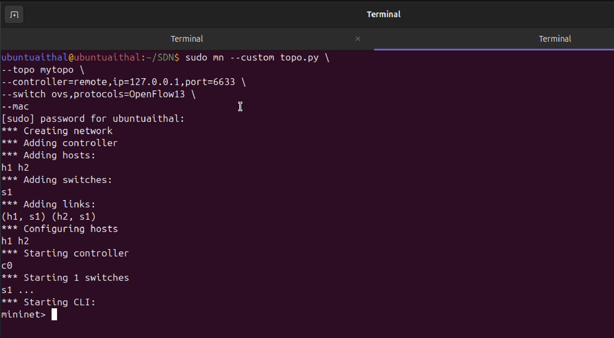
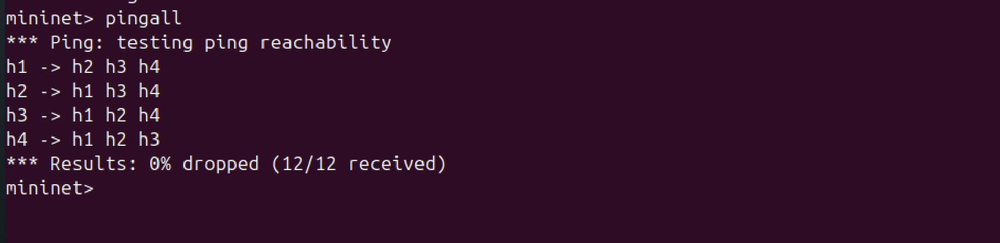
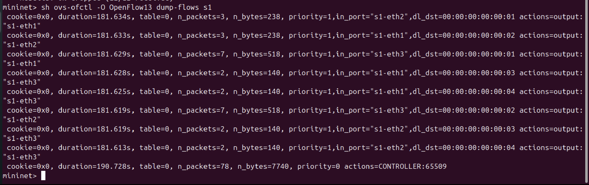
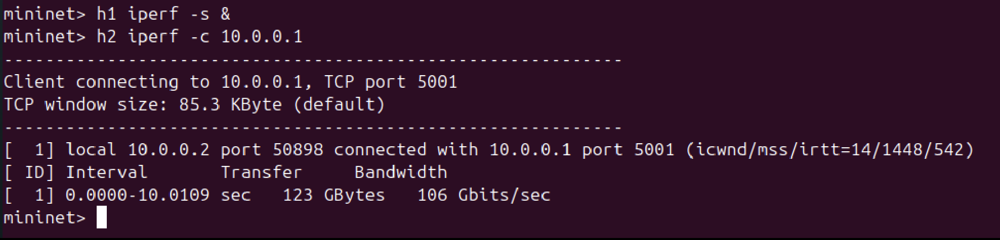
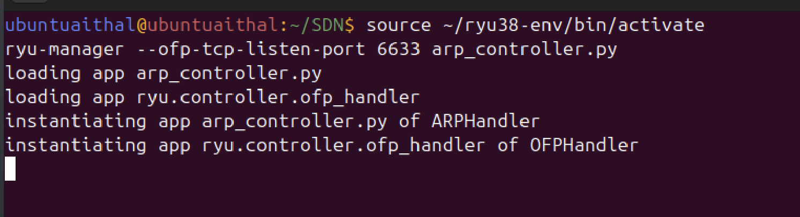
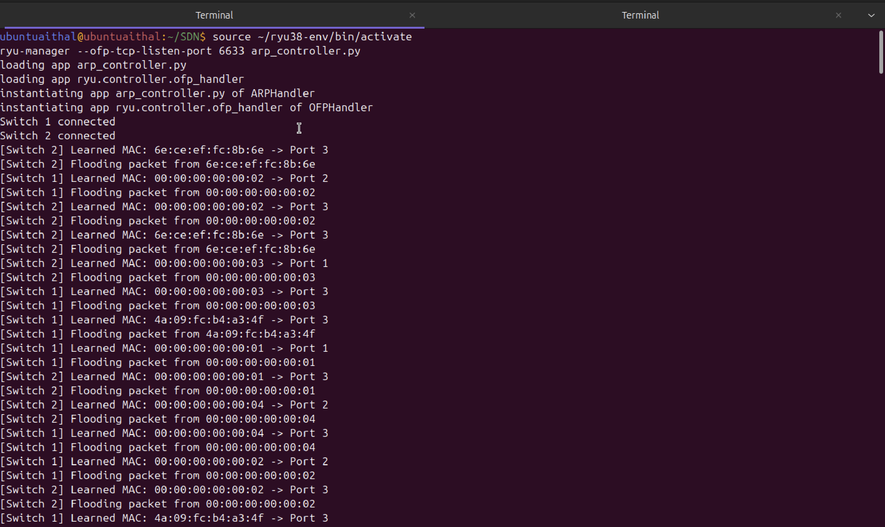
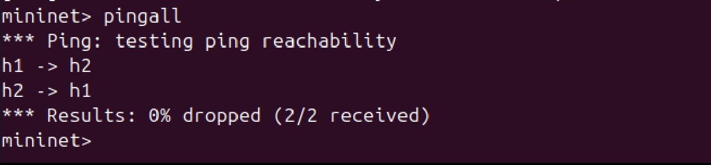

# ARP Handling in SDN using Ryu Controller and Mininet

---

##  Problem Statement

Implement ARP request and reply handling using an SDN controller. The controller intercepts ARP packets, generates ARP responses, enables host discovery, and validates communication in a Mininet-based network.

---

##  Objective

* Demonstrate controller–switch interaction
* Implement match–action flow rules
* Handle ARP packets using SDN controller logic
* Enable communication between hosts
* Observe network behavior

---

##  Tools & Technologies Used

* Mininet
* Ryu Controller (OpenFlow 1.3)
* Open vSwitch (OVS)
* Python

---

##  Network Topology

```
        h1        h2
         |        |
         |        |
         s1 ------ s2
         |        |
         |        |
        h3        h4

```

* h1: 10.0.0.1
* h2: 10.0.0.2
* h3: 10.0.0.3
* h4: 10.0.0.4
* s1,s2: OpenFlow switches

---

##  Setup and Execution Steps

### Step 1: Clean Mininet

```bash
sudo mn -c
```

---

### Step 2: Start Ryu Controller (Terminal 1)

```bash
cd ~/SDN
source ~/ryu38-env/bin/activate
ryu-manager --ofp-tcp-listen-port 6633 arp_controller.py
```

---

### Step 3: Start Mininet (Terminal 2)

```bash
cd ~/SDN

sudo mn --custom topo.py \
--topo mytopo \
--controller=remote,ip=127.0.0.1,port=6633 \
--switch ovs,protocols=OpenFlow13 \
--mac
```

---

##  Testing & Validation

---

###  1. Network Topology Execution

```bash
(mininet startup output)
```



✔ Shows hosts (h1, h2, h3, h4), switch (s1,s2), and links created successfully.

---

###  2. Ping Test (Connectivity)

```bash
pingall
```



✔ Result: 0% packet loss — successful end-to-end communication established.

---

###  3. Flow Table Verification

```bash
sh ovs-ofctl -O OpenFlow13 dump-flows s1
```



✔ Shows:

* Flow rules installed for all hosts
* Default rule sending packets to controller

---

###  4. Throughput Test (iperf)

```bash
h1 iperf -s &
h2 iperf -c 10.0.0.1
```



✔ Displays bandwidth (Gbps), confirming successful data transfer.

---

###  5. Controller Logs



✔ Shows:

* Controller startup
* Packet processing
* ARP handling

---

###  6. ARP Learning & Reply



✔ Shows:

* Learned IP–MAC mappings
* ARP replies generated by controller

---

###  7. Failure Scenario (Controller Stopped)

```bash
pingall
```



 Result: 100% packet loss
 Demonstrates dependency on controller-installed flow rules.

---

##  Working Explanation

* Initially, packets are sent to the controller via PacketIn events
* The controller processes ARP requests and learns IP–MAC mappings
* It generates ARP replies for known hosts
* Flow rules are installed in the switch
* After flow installation, packets are forwarded directly by the switch

---

##  Performance Observation

* Initial packets involve the controller (higher latency)
* After flow installation, packets bypass the controller
* Reduced delay and improved performance
* Flow table entries increase after communication

---

##  Proof of Execution

* Topology creation
* Ping test (0% loss)
* Flow table entries
* Throughput measurement (iperf)
* Controller logs
* ARP learning
* Failure scenario

---

##  Results

* ARP requests successfully intercepted
* ARP replies generated by controller
* Hosts discovered dynamically
* Communication established between hosts
* Flow rules installed correctly
* Network fails when controller is removed

---

##  Author

Abhishek Aithal

